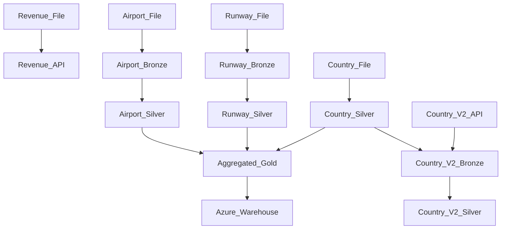

# Eneco Assignment

A small data-processing pipeline for ingesting aviation data, applying cleansing and transformations, validating outputs, and running SQL-based analysis.

## Project Overview

This project reads data from multiple sources such as CSV files and an API, processes it through bronze, silver, and gold layers based on Medallion Architecture, and writes the results to local SQLite storage or external targets.

Based on the datasets and requirements provided in the assignment, the following data flow is created:



Please note countries data from the csv file is directly ingested to silver layer because the assignment mentions that its supplied in high quality. Countries V2 is the dataset coming from the new next-gen platform. For simplicity, partitions, history or versions are not maintained in any table.

## Repository Structure

- `main.py`  
  CLI entry point for loading data, validating datasets, and running analysis

- `src/core/`  
  Core pipeline workflows


- `src/io/`  
  Input/output adapters to create the concept of a unified IO layer supporting some readers and writers for API, Azure, Postgres, Sqlite systems and files which were needed for the assignment

- `src/transformations/`  
  Custom transformation logic for derived datasets

- `src/utils/`  
  Shared utility functions, for example, cleanser supporting trim, null_fill, rename_columns and apply_schema cleansing rules and validator supporting not_null_counts, completeness(opposite of referential integrity), uniqueness, range and null at-rest quality checks with thresholds(maximum by default if undefined)

- `catalog/`  
  Metadata definitions for each dataset, including configurations for pipeline with cleansing rules and data quality checks

- `sql/`  
  SQL queries used for analysis tasks

- `data/`  
  Local input files used by the pipeline

- `tests/`  
  Unit tests for utility modules

## Instructions to run

Install dependencies with:

```bash
pip install -r requirements.txt
```

Unit tests are provided for some functions and can be run by:
```bash
pytest
```

Data is already ingested and present in the data/data.db file but in case you want to ingest data end to end again, following is the sequence of commands to run. After one end to end run is completed you can also run any of these commands randomly, since the pipeline steps are idempotent.


```bash
python main.py load-data bronze_airports
python main.py load-data bronze_runways
python main.py load-data silver_countries
python main.py load-data silver_airports
python main.py load-data silver_runways
python main.py load-data bronze_countries_v2
python main.py load-data silver_countries_v2
python main.py load-data gold_airport_statistics
python main.py load-data output_airport_statistics
python main.py load-data output_revenues
```

Commands to run to validate data: 

```bash
python main.py validate bronze_airports
python main.py validate bronze_runways
python main.py validate silver_countries
python main.py validate silver_airports
python main.py validate silver_runways
python main.py validate bronze_countries_v2
python main.py validate silver_countries_v2
```
Support for cross-table aggregate level checks can be added

Commands to run for analysis:

```bash
python main.py analyze check_airports.sql sqlite
python main.py analyze check_runways.sql sqlite
python main.py analyze compare_purchases.sql postgres
python main.py analyze recommend_albums_old.sql postgres
python main.py analyze recommend_albums_new.sql postgres
```

If you want to run any other query, just put it in the file adhoc_query.sql and run the following:

```bash
python main.py analyze adhoc_query.sql sqlite/postgres
```